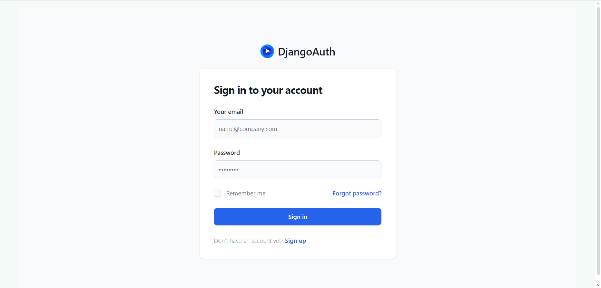
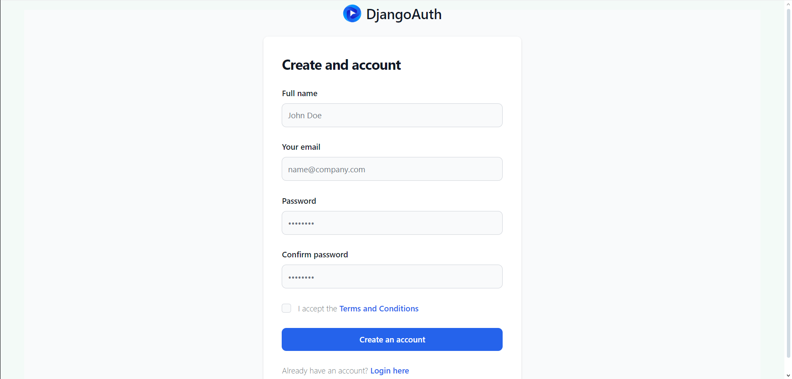
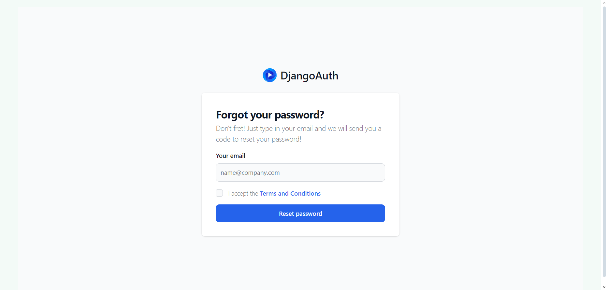
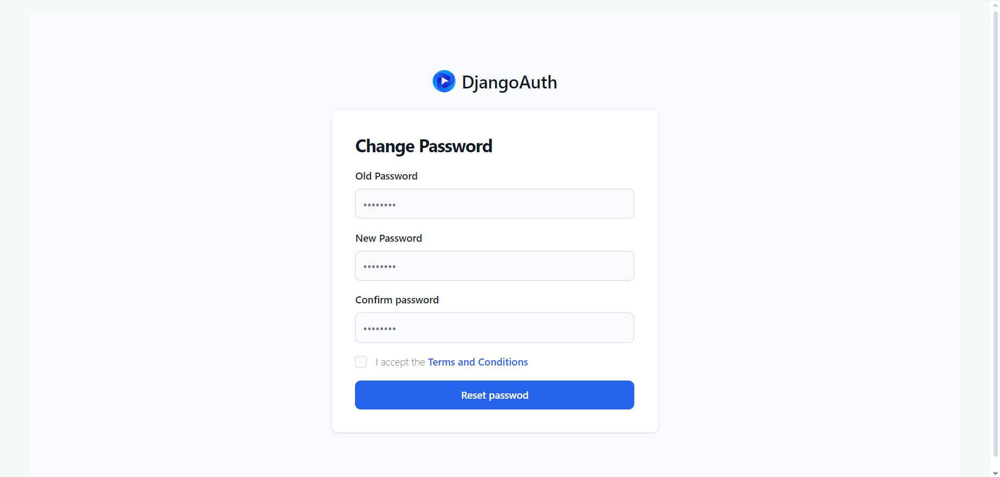

<!-- python -m venv env

cmd: 
    venv\Scripts\activate
PowerShell:
    .\venv\Scripts\Activate.ps1
Git Bash:
    source venv/Scripts/activate

python -m pip install --upgrade pip

python -m pip install django-compressor -->

# Django Auth Project

This is a Django project for authentication purposes.

## Screenshot
<table style="width:100%">
  <tr>
    <th>Login</th>
    <th>Register</th> 
  </tr>
  <tr>
    <td></td>
    <td></td> 
  </tr>
  <tr>
    <th>Forgot Password</th>
    <th>Reset Password</th>
  </tr>
  <tr>
    <td></td>
    <td></td>
  </tr>
</table>


## Getting Started

Follow these instructions to get a local copy of the project up and running on your machine.

### Prerequisites

- Python (3.6 or higher)
- pip (Python package installer)
- git

### Installation

Clone the repository:

```bash
git clone https://github.com/hakodridi/django_auth.git
```
Navigate to the project directory:

```bash
cd django_auth
```

Create and activate a virtual environment (optional but recommended):
```bash
# On Windows
python -m venv venv
venv\Scripts\activate

# On macOS/Linux
python3 -m venv venv
source venv/bin/activate
```
Upgrade pip to the latest version:
```bash
python -m pip install --upgrade pip
```

Install project dependencies:
```bash
pip install -r requirements.txt
```

Make database migrations:
```bash
python manage.py makemigrations
python manage.py migrate
```

### Configure SMTP Email Settings
In the settings.py file located in the django_auth directory, configure the SMTP email settings by updating the following variables:

```python
# Configure SMTP email settings
EMAIL_BACKEND = 'django.core.mail.backends.smtp.EmailBackend'
EMAIL_HOST = 'YOUR_SMTP_SERVER_HOST'  # SMTP server host
EMAIL_PORT = YOUR_SMTP_PORT  # SMTP port
EMAIL_USE_SSL = True  # Use SSL
EMAIL_HOST_USER = 'YOUR_EMAIL_ADDRESS'  # Your email address
EMAIL_HOST_PASSWORD = 'YOUR_EMAIL_PASSWORD'  # Your email password
```
Remove the '#' character at the beginning of each line to uncomment the settings. Replace the placeholders with your SMTP server host, SMTP port, email address, and email password.


### Running the Server
To start the development server, run:
```bash
python manage.py runserver
```

The server will start running at <a href="http://127.0.0.1:8000/" target="_blank">http://127.0.0.1:8000/</a>.

You can now visit this URL in your web browser to view the project.